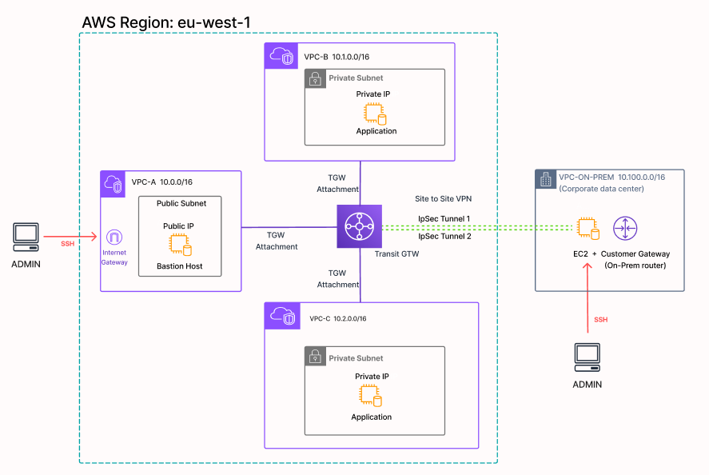

# Multi-VPC Transit Gateway with Site-to-Site VPN


## Overview

In this project I attempted to set up a production-grade AWS networking architecture featuring multiple VPCs connected through a Transit Gateway, with a simulated on-premises data center connected via Site-to-Site VPN using StrongSwan.

The architecture showcases hybrid cloud connectivity patterns commonly used in enterprise environments for connecting cloud infrastructure with on-premises networks.

## Architecture

### Architecture Diagram



**Network Topology:**

- 3 VPCs in the cloud (VPC-A: 10.0.0.0/16, VPC-B: 10.1.0.0/16, VPC-C: 10.2.0.0/16)
- 1 VPC simulating on-premises network (10.100.0.0/16)
- AWS Transit Gateway providing hub-and-spoke connectivity between cloud VPCs
- Site-to-Site VPN connection between Transit Gateway and on-premises VPN endpoint
- StrongSwan IPsec VPN software on EC2 instance acting as Customer Gateway

## Prerequisites before installation

- AWS Account with appropriate permissions
- Terraform >= 1.0
- AWS CLI configured
- SSH key pair for EC2 access
- Basic understanding of networking concepts (subnets, routing, VPNs)

## Deployment

### 1. Clone the repository

```bash
git clone https://github.com/your-username/multi-vpc-tgw-vpn.git
cd multi-vpc-tgw-vpn
```

### 2. Update variables

Edit your Terraform variables file with your specific values:

- AWS region
- SSH key pair name
- Your IP address (for SSH access)

### 3. Initialize, Review, Appply

```bash
terraform init
```

```bash
terraform plan
```

```bash
terraform apply
```

### 4. Configure StrongSwan VPN

After infrastructure is deployed:

a. Download VPN configuration from AWS Console: VPC → Site-to-Site VPN Connections → Download Configuration

b. SSH into the on-premises EC2 instance:

```bash
ssh -i your-key.pem ubuntu@
```

c. Configure `/etc/ipsec.conf`:

```bash
sudo nano /etc/ipsec.conf
```

Paste the configuration from the downloaded file (Tunnel #1 section)

d. Configure `/etc/ipsec.secrets`:

```bash
sudo nano /etc/ipsec.secrets
```

Add the pre-shared key from the downloaded configuration

e. Set proper permissions:

```bash
sudo chmod 600 /etc/ipsec.secrets
```

f. Restart StrongSwan:

```bash
sudo systemctl restart strongswan-starter
sudo ipsec status
```

### 5. Verify VPN tunnel

Check that the tunnel shows `ESTABLISHED`:

```bash
sudo ipsec status
```

## 6. Test connectivity

From the on-premises EC2, ping an EC2 instance in one of the cloud VPCs:

```bash
ping
```

## Features

Follow these steps to check its working:

- **Transit Gateway Hub:** Centralized routing for multiple VPCs
- **Site-to-Site VPN:** IPsec tunnel between on-premises and AWS
- **StrongSwan Configuration:** Open-source VPN software for customer gateway
- **Security Best Practices:**
  - Security groups restricting traffic
  - Private subnets for workloads
  - VPN encryption for data in transit
- **Automated Infrastructure:** Everything except StrongSwan config deployed via Terraform
- **High Availability:** AWS provides dual-tunnel VPN (project uses single tunnel for simplicity)

## Technologies Used

- **Infrastructure as Code:** Terraform
- **Cloud Provider:** AWS
  - VPC
  - EC2
  - Transit Gateway
  - Site-to-Site VPN
  - Elastic IP
  - Security Groups
  - Route Tables
- **VPN Software:** StrongSwan (IPsec)
- **Operating System:** Ubuntu 22.04

## Technical Skills

- Configuring AWS Transit Gateway for multi-VPC connectivity
- Setting up Site-to-Site VPN connections with AWS
- Installing and configuring StrongSwan IPsec VPN software
- Understanding IPsec tunnel establishment (IKE Phase 1 and Phase 2)
- Implementing complex routing across multiple network segments
- Using Terraform for infrastructure automation

## Troubleshooting Experience

- Debugging cloud-init user_data script failures
  - Identifying CRLF line ending issues using hexdump
  - Understanding the importance of shebang placement
  - Resolving VPN tunnel connectivity issues
  - Analyzing IPsec tunnel status and packet counters
  - Troubleshooting Transit Gateway route table associations
  - Configuring EC2 source/destination checks for routing
- Working with security groups and network ACLs

## DevOps Best Practices

- Using version control (Git) for infrastructure code
- Writing clear commit messages
- Organizing Terraform code by resource type
- Understanding the difference between `security_groups` and `vpc_security_group_ids`
- Proper use of Terraform resource targeting
- Importance of `terraform plan` before `apply`

## Cleanup

To destroy all resources:

```bash
terraform destroy
```

**Note:** This will delete all infrastructure and cannot be undone.

## License

This project is open source and available under the MIT License.

## Author

Devron - [LinkedIn](https://www.linkedin.com/in/devrontombacco/) | [GitHub](https://github.com/devrontombacco)

## Acknowledgments

- AWS Documentation for VPN configuration guidance
- StrongSwan documentation
- ChatGPT and Claude ai for troubleshooting assistance during development
